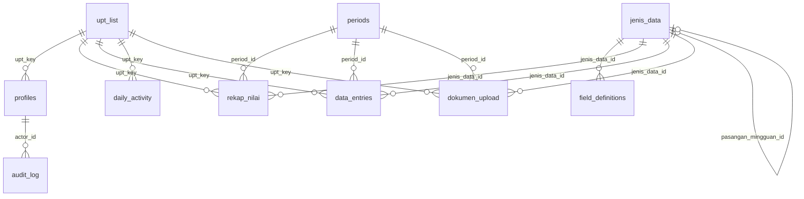

# 04 — Database `Puslatkp1a`

* Mesin: MySQL 8 (InnoDB), karakter `utf8mb4`, collation `utf8mb4_unicode_ci`.
* Sumber kebenaran skema: `be/scripts/ddl.sql`. Berkas siap-impor `database/puslatkp1a.sql` dihasilkan dengan
  `cd be && npm run db:build` (skema + data master + akun awal).
* Semua ID berupa `CHAR(36)` (UUID). Zona waktu koneksi diset UTC; kolom `DATE` dikirim ke klien sebagai
  `YYYY-MM-DD`, `DATETIME` sebagai ISO 8601.

## ERD



## Tabel

### `upt_list` — Unit Pelaksana Teknis
> **Hapus UPT = hapus datanya.** Semua tabel yang memuat `upt_key` (`profiles`, `rekap_nilai`, `data_entries`,
> `dokumen_upload`, `daily_activity`) memakai `ON DELETE CASCADE`: menghapus satu baris UPT otomatis menghapus akun,
> rekap, data rincian, berkas, dan aktivitasnya. Dashboard/grafik/rekap tidak lagi memuat UPT tersebut.
> Database yang diimpor dari versi lama perlu menjalankan `database/migrasi_01_hapus_upt_cascade.sql` sekali.

| Kolom | Tipe | Keterangan |
| :-- | :-- | :-- |
| `key` (PK) | VARCHAR(64) | Mis. `upt_jakarta` |
| `label` | VARCHAR(150) | Nama tampilan, mis. `BPPP Jakarta` |
| `aktif` | TINYINT(1) | Hanya UPT aktif yang muncul di pilihan |

### `profiles` — Akun pengguna
| Kolom | Tipe | Keterangan |
| :-- | :-- | :-- |
| `id` (PK) | CHAR(36) | |
| `email` | VARCHAR(190), **unik** | Huruf kecil |
| `password_hash` | VARCHAR(100) | bcrypt (cost 10). Tidak pernah dikirim ke klien |
| `role` | ENUM(`admin`,`upt`) | |
| `upt_key` | VARCHAR(64) → `upt_list.key` | `NULL` untuk admin. `ON DELETE CASCADE` (akun ikut terhapus bersama UPT-nya) |
| `nama_lengkap`, `created_at` | | |

### `jenis_data` — Jenis Data (mingguan / bulanan)
| Kolom | Tipe | Keterangan |
| :-- | :-- | :-- |
| `id` (PK), `key` (unik), `judul`, `deskripsi` | | |
| `level_utama` | ENUM(`minggu`,`bulan`) | Level tempat data diinput |
| `mode_bulanan` | ENUM(`rincian`,`agregasi`,`upload_file`) NULL | Level bulan: `rincian` = per nama, `agregasi` = rekap angka saja (dijumlah dari mingguan). `upload_file` hanya warisan lama (tidak ditawarkan lagi di UI) |
| `butuh_input_bulanan` | TINYINT(1) | |
| `pasangan_mingguan_id` | → `jenis_data.id` | Jenis data mingguan pasangan (validasi silang) |
| `publik_boleh_lihat` | TINYINT(1) | Tampil di `/publik` (agregat saja) |
| `multi_baris` | TINYINT(1) | Mingguan: boleh >1 pelatihan (baris) per minggu. Bawaan 1 untuk Masyarakat, Aparatur, Data Belanja Modal |
| `aktif`, `dibuat_oleh`, `created_at` | | |

Sembilan jenis data bawaan (berpasangan):

| Mingguan | Bulanan (`mode_bulanan`) |
| :-- | :-- |
| Masyarakat | Data Masyarakat (`rincian`) |
| Aparatur | Data Aparatur (`rincian`) |
| Data Instruktur dan WI | Data Instruktur dan Widyaiswara (`upload_file`) |
| Data Belanja Modal · Capaian Anggaran per Jenis Belanja · Capaian Anggaran per Sumber Dana | (mingguan saja, tidak dipublikasikan) |

### `periods` — Periode pelaporan
1 tahun = 1 periode `tahun` + 4 `triwulan` + 12 `bulan` + **48 `minggu`** (4 minggu per bulan: tanggal 1–7, 8–14,
15–21, 22–akhir bulan).

| Kolom | Keterangan |
| :-- | :-- |
| `id` | UUID **deterministik** dari (level, tahun, triwulan, bulan, minggu) → aman dijalankan ulang |
| `level` | `tahun` / `triwulan` / `bulan` / `minggu` |
| `tahun`, `triwulan_ke`, `bulan`, `minggu_ke` | Posisi periode (bisa `NULL` sesuai level) |
| `tanggal_mulai`, `tanggal_selesai` | Rentang periode |
| `deadline` | Batas akhir pengisian. Setelahnya UPT **tetap bisa mengisi**, tetapi datanya ditandai `terlambat` |
| `label` | Mis. `Minggu ke-2 September 2026` |

**Aturan deadline**: minggu → akhir minggu berikutnya (minggu ke-4 → tanggal 7 bulan berikutnya); bulan → akhir bulan
berikutnya; triwulan → akhir triwulan berikutnya; tahun → 30 Juni tahun berikutnya.
Data bawaan hanya mencakup **2026**; tahun lain dibuat dengan `npm run periods -- <tahun>`.

### `field_definitions` — Form Builder
Kolom-kolom form per Jenis Data per level.

| Kolom | Keterangan |
| :-- | :-- |
| `jenis_data_id`, `level`, `field_key` | Kunci unik gabungan |
| `label`, `urutan`, `aktif`, `wajib` | Tampilan & validasi |
| `tipe` | `angka` / `teks` / `teks_panjang` / `tanggal` / `pilihan` |
| `opsi_pilihan` | JSON array (untuk `pilihan`) |
| `is_identitas` | Data pribadi (NIK, telepon, alamat, NIP) – **tidak pernah ditampilkan ke publik** |
| `agregasi` | Cara rekap bulan/triwulan/tahun: `sum` (jumlahkan) / `last` (nilai terakhir, angka kumulatif) / `avg` / `max`. Bawaan: pagu*, realisasi*, jumlah instruktur/widyaiswara, volume = `last` |

### Tempat sampah (soft delete)
Tabel `rekap_nilai`, `data_entries`, `dokumen_upload`, `daily_activity` memiliki kolom `deleted_at` (NULL = aktif),
`deleted_by` dan `deleted_batch` (satu aksi hapus = satu batch). Semua query aplikasi hanya membaca baris dengan
`deleted_at IS NULL`; view `v_publik_rekap` juga menyaringnya. Baris yang lebih dari 30 hari terhapus dibuang permanen
otomatis. Database yang diimpor sebelum fitur ini perlu menjalankan `database/migrasi_02_tempat_sampah.sql`.

> Saat memeriksa data langsung di phpMyAdmin, tambahkan `WHERE deleted_at IS NULL` agar tidak ikut melihat baris di tempat sampah.

### Kolom `terlambat`
`rekap_nilai`, `data_entries`, dan `dokumen_upload` punya `terlambat` (TINYINT, bawaan 0). Diisi **server** = 1 bila akun UPT menyimpan setelah
`periods.deadline`; menempel sampai Admin/UPT menghapus datanya. Baris sebelum migrasi_04 tidak ditandai (waktu isi aslinya tidak tercatat).

### `rekap_nilai` — Nilai rekap mingguan/agregat
Satu baris per (jenis_data, upt, periode, **`baris_ke`**, `field_key`) – **unik gabungan** sehingga simpan ulang =
perbarui. `baris_ke` (bawaan 1) membedakan beberapa pelatihan dalam satu minggu.
`value` (DECIMAL 24,4) untuk angka, `value_text` untuk teks. `updated_at` otomatis, `updated_by` diisi server.

### `data_entries` — Data rincian per baris (level bulan)
`nama`, `nik`, dan seluruh isian di `data_json` (JSON); kolom tak dikenal saat impor Excel disimpan di
`data_ekstra`. Unik gabungan (jenis_data, upt, periode, `nik`) → impor Excel ulang memperbarui, bukan menggandakan.
(MySQL mengizinkan banyak `NULL` pada kolom unik, jadi baris tanpa NIK tidak saling bentrok.)

### `dokumen_upload` — Berkas bulanan (mode `upload_file`)
Metadata + isi berkas sebagai *data URL* base64 di `file_data` (LONGTEXT), maks. 15 MB/berkas (dicek UI).

### `arsip_historis` — Arsip Data Historis
Metadata berkas Excel/PDF tahun lalu (`tahun`, `upt_key` NULL = arsip pusat, `jenis_data_id` opsional, `judul`, `file_name`, `file_ext`, `file_size`,
`storage_key`). **Isi berkas ada di disk** (`be/storage/arsip/<storage_key>`, atau `STORAGE_DIR`), bukan di MySQL. Ikut terhapus bila UPT dihapus
(`ON DELETE CASCADE`); berkasnya disapu otomatis.

### `dashboard_widgets` — Pengaturan Dashboard
Satu baris = satu kartu/grafik (`tipe`, `judul`, `grup`, `gaya`, `ikon`, `warna`, `satuan`, `urutan`, `aktif`). Sumber angka ada di kolom JSON
`konfigurasi` (`items`/`pembanding`/`series` berisi pasangan `{jd: kunci jenis data, field: field_key}`). Tabel kosong = tampilan bawaan
(`fe/src/lib/dashboardWidgets.js`). Baca: semua akun login; tulis: Admin.

### `daily_activity` — Aktivitas harian (tidak dipakai lagi)
> Menu Daily Activity & Highlights sudah dihapus dari aplikasi. Tabel dan datanya sengaja **dibiarkan** agar tidak ada data hilang; boleh di-`DROP` bila memang tidak diperlukan.

`tanggal`, `status` (`draft`/`proses`/`selesai`), `uraian`, `pic` (JSON array nama), `lingkup`
(`internal_puslat`/`internal_kkp`/`internal_eksternal`/`eksternal`), `output`, `hambatan` + `hambatan_keterangan`,
`interaksi`, `feedback`, `foto_url`, `dokumen_url`.

### `audit_log`
Catatan aksi (mis. `import_kolom_tidak_dikenal`) dengan `actor_id`, `actor_upt_key`, `detail` (JSON).

### `v_publik_rekap` (view)
Jumlah baris `data_entries` per jenis data & periode, **hanya** untuk jenis data `publik_boleh_lihat = 1` dan
`aktif = 1`. Tidak memuat data pribadi; inilah satu-satunya data yang dapat dibaca tanpa login.

## Data awal (seed)

| Isi | Jumlah |
| :-- | :-- |
| UPT (BPPP Jakarta, Medan, Banyuwangi, Tegal, Bitung, Ambon, Padang, Pontianak, Makassar, Sorong) | 10 |
| Akun (1 admin + 10 UPT) | 11 |
| Jenis Data | 9 |
| Definisi kolom | 87 |
| Periode 2026 | 65 |

## Backup & restore

```bash
# Backup
mysqldump -u root -p --routines --single-transaction Puslatkp1a > backup_puslatkp1a.sql
# Restore
mysql -u root -p Puslatkp1a < backup_puslatkp1a.sql
```

Atau lewat phpMyAdmin: **Export** (Quick, SQL) dan **Import**.

> **Penting:** `mysqldump`/phpMyAdmin **tidak mencakup berkas Arsip Historis**. Backup juga folder `be/storage` (atau `STORAGE_DIR`; pada Docker: volume `be-storage`)
> dan pulihkan bersama dump database yang sesuai.
