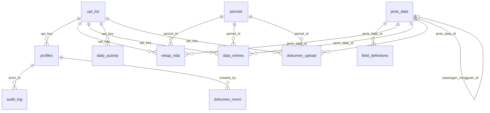

# 04 — Database `Puslatkp1a`

* Mesin: MySQL 8 (InnoDB), karakter `utf8mb4`, collation `utf8mb4_unicode_ci`.
* Sumber kebenaran skema: `be/scripts/ddl.sql`. Berkas siap-impor `database/puslatkp1a.sql` dihasilkan dengan
  `cd be && npm run db:build` (skema + data master + akun awal).
* Semua ID berupa `CHAR(36)` (UUID). Zona waktu koneksi diset UTC; kolom `DATE` dikirim ke klien sebagai
  `YYYY-MM-DD`, `DATETIME` sebagai ISO 8601.

## ERD


```mermaid
erDiagram
  upt_list ||--o{ profiles : "upt_key"
  upt_list ||--o{ rekap_nilai : "upt_key"
  upt_list ||--o{ data_entries : "upt_key"
  upt_list ||--o{ daily_activity : "upt_key"
  upt_list ||--o{ dokumen_upload : "upt_key"
  jenis_data ||--o{ field_definitions : "jenis_data_id"
  jenis_data ||--o{ rekap_nilai : "jenis_data_id"
  jenis_data ||--o{ data_entries : "jenis_data_id"
  jenis_data ||--o{ dokumen_upload : "jenis_data_id"
  jenis_data |o--o| jenis_data : "pasangan_mingguan_id"
  periods ||--o{ rekap_nilai : "period_id"
  periods ||--o{ data_entries : "period_id"
  periods ||--o{ dokumen_upload : "period_id"
  profiles ||--o{ audit_log : "actor_id"
  profiles ||--o{ dokumen_resmi : "created_by"
```

## Tabel

### `upt_list` — Unit Pelaksana Teknis
> **Hapus UPT = hapus datanya.** Semua tabel yang memuat `upt_key` (`profiles`, `rekap_nilai`, `data_entries`,
> `dokumen_upload`, `daily_activity`) memakai `ON DELETE CASCADE`: menghapus satu baris UPT otomatis menghapus akun,
> rekap, data rincian, berkas, dan aktivitasnya. Dashboard/grafik/rekap tidak lagi memuat UPT tersebut.
> Database yang diimpor dari versi lama perlu menjalankan `database/migrasi_01_hapus_upt_cascade.sql` sekali.

| Kolom | Tipe | Keterangan |
| :-- | :-- | :-- |
| `key` (PK) | VARCHAR(64) | Mis. `upt_jakarta` |
| `label` | VARCHAR(150) | Nama tampilan, mis. `BPPP Jakarta` |
| `aktif` | TINYINT(1) | Hanya UPT aktif yang muncul di pilihan |

### `profiles` — Akun pengguna
| Kolom | Tipe | Keterangan |
| :-- | :-- | :-- |
| `id` (PK) | CHAR(36) | |
| `email` | VARCHAR(190), **unik** | Huruf kecil |
| `password_hash` | VARCHAR(100) | bcrypt (cost 10). Tidak pernah dikirim ke klien |
| `role` | ENUM(`admin`,`upt`) | |
| `upt_key` | VARCHAR(64) → `upt_list.key` | `NULL` untuk admin. `ON DELETE CASCADE` (akun ikut terhapus bersama UPT-nya) |
| `nama_lengkap`, `created_at` | | |

### `jenis_data` — Jenis Data (mingguan / bulanan)
| Kolom | Tipe | Keterangan |
| :-- | :-- | :-- |
| `id` (PK), `key` (unik), `judul`, `deskripsi` | | |
| `level_utama` | ENUM(`minggu`,`bulan`) | Level tempat data diinput |
| `mode_bulanan` | ENUM(`rincian`,`agregasi`,`upload_file`) NULL | Level bulan: `rincian` = per nama, `agregasi` = rekap angka saja (dijumlah dari mingguan). `upload_file` hanya warisan lama (tidak ditawarkan lagi di UI) |
| `butuh_input_bulanan` | TINYINT(1) | |
| `pasangan_mingguan_id` | → `jenis_data.id` | Jenis data mingguan pasangan (validasi silang) |
| `publik_boleh_lihat` | TINYINT(1) | Tampil di `/publik` (agregat saja) |
| `multi_baris` | TINYINT(1) | Mingguan: boleh >1 pelatihan (baris) per minggu — tombol "Tambah pelatihan lain". Bawaan aktif untuk Masyarakat, Aparatur, Data Belanja Modal, Data Instruktur dan WI (mingguan) |
| `kumulatif_bulanan` | TINYINT(1) | **Migrasi 07.** Hanya untuk bulanan `rincian` (Per nama): bulan terbaru dianggap **menggantikan** bulan sebelumnya (UPT mengunggah roster lengkap tiap bulan), bukan dataset bulanan terpisah-pisah. Saat aktif, tampilan **Data by Name** otomatis meloncat ke bulan terakhir yang sudah ada datanya bila bulan yang dipilih masih kosong |
| `aktif`, `dibuat_oleh`, `created_at` | | |

Sembilan jenis data bawaan (berpasangan) dari instalasi awal:

| Mingguan | Bulanan (`mode_bulanan`) |
| :-- | :-- |
| Masyarakat | Data Masyarakat (`rincian`) |
| Aparatur | Data Aparatur (`rincian`) |
| Data Instruktur dan WI | Data Instruktur dan Widyaiswara (`upload_file`) |
| Data Belanja Modal · Capaian Anggaran per Jenis Belanja · Capaian Anggaran per Sumber Dana | (mingguan saja, tidak dipublikasikan) |

> Admin bebas menambah/mengubah jenis data lewat **Kelola Jenis Data** (termasuk lewat wizard **Buat dari Excel**,
> lihat [06-panduan-pengguna.md](06-panduan-pengguna.md#kelola-jenis-data-form-builder)); daftar di atas hanya
> baseline instalasi. Di lingkungan pengembangan saat ini, misalnya, "Data Aparatur" dan "Data Instruktur dan WI"
> (bulanan) sudah direstrukturisasi ulang kolom-kolomnya lewat menu Admin — struktur kolom yang berlaku selalu
> yang ada di `field_definitions`, bukan tabel di atas.

### `periods` — Periode pelaporan
1 tahun = 1 periode `tahun` + 4 `triwulan` + 12 `bulan` + **48 `minggu`** (4 minggu per bulan: tanggal 1–7, 8–14,
15–21, 22–akhir bulan).

| Kolom | Keterangan |
| :-- | :-- |
| `id` | UUID **deterministik** dari (level, tahun, triwulan, bulan, minggu) → aman dijalankan ulang |
| `level` | `tahun` / `triwulan` / `bulan` / `minggu` |
| `tahun`, `triwulan_ke`, `bulan`, `minggu_ke` | Posisi periode (bisa `NULL` sesuai level) |
| `tanggal_mulai`, `tanggal_selesai` | Rentang periode |
| `deadline` | Batas akhir pengisian. Setelahnya UPT **tetap bisa mengisi**, tetapi datanya ditandai `terlambat` |
| `label` | Mis. `Minggu ke-2 September 2026` |

**Aturan deadline**: minggu → akhir minggu berikutnya (minggu ke-4 → tanggal 7 bulan berikutnya); bulan → akhir bulan
berikutnya; triwulan → akhir triwulan berikutnya; tahun → 30 Juni tahun berikutnya.
Data bawaan hanya mencakup **2026**; tahun lain dibuat dengan `npm run periods -- <tahun>`.

### `field_definitions` — Form Builder
Kolom-kolom form per Jenis Data per level.

| Kolom | Keterangan |
| :-- | :-- |
| `jenis_data_id`, `level`, `field_key` | Kunci unik gabungan |
| `label`, `urutan`, `aktif`, `wajib` | Tampilan & validasi |
| `tipe` | `angka` / `teks` / `teks_panjang` / `tanggal` / `pilihan` / `file` (unggah PDF/Word/Excel — lihat `field_files` di bawah) |
| `opsi_pilihan` | JSON array (untuk `pilihan`), dipakai bila `opsi_bersyarat` kosong |
| `opsi_bersyarat` | **Migrasi 09.** JSON, opsional, hanya untuk `pilihan`: `{ "depends_on": "<field_key kolom lain>", "options": { "<nilai 1>": [...], "<nilai 2>": [...] } }`. Opsi dropdown kolom ini lalu **berbeda tergantung nilai kolom `depends_on`** di baris yang sama (mis. "Jenjang Jabatan" beda opsinya untuk "Jenis" = Instruktur vs Widyaiswara pada jenis data *Data Instruktur dan WI*). Diatur lewat editor di **Kelola Jenis Data** (centang "Opsi tergantung kolom lain" saat kolom bertipe Pilihan; kolom acuan yang diisi di `depends_on` harus sudah ada lebih dulu sebagai kolom Pilihan beropsi tetap). Mengubah kolom `depends_on` di form otomatis mengosongkan ulang kolom yang bergantung padanya (lihat `fe/src/components/DynamicForm.jsx`) |
| `is_identitas` | Data pribadi (NIK, telepon, alamat, NIP) – **tidak pernah ditampilkan ke publik** |
| `agregasi` | Cara rekap bulan/triwulan/tahun: `sum` (jumlahkan) / `last` (nilai terakhir, angka kumulatif) / `avg` / `max`. **Bawaan kolom angka mingguan baru: `last`** (dianggap angka berjalan/kumulatif kecuali diubah manual di Kelola Jenis Data) |
| `peran_rekap` | **Migrasi 16.** `judul` / `peserta` / `pagu` / `realisasi` / NULL — angka ringkasan mana di Rekap UPT/Balai & Rekap Bulanan yang diisi kolom ini (Pelatihan = jumlah baris berisi kolom `judul`; Peserta/Pagu/Realisasi = jumlah nilainya). Dipilih Admin di Kelola Jenis Data ("Dihitung di rekap sebagai"), sehingga rekap tidak lagi bergantung pada nama kolom tertentu. Migrasi mengisi kolom lama **persis** dengan aturan nama sebelumnya (`nama_pelatihan` → judul, `jumlah_peserta` → peserta, mengandung `pagu` → pagu, mengandung `realisasi_anggaran` → realisasi) agar angka rekap tidak berubah. Tanpa migrasi_16 (atau untuk nilai dari kolom yang definisinya sudah dihapus) frontend jatuh ke aturan nama itu — lihat `fe/src/lib/peranRekap.js` |

### `field_files` — Berkas kolom bertipe `file`
Satu baris = satu berkas yang diunggah UPT untuk mengisi SATU sel bertipe `file` (mis. "Link Laporan Pelatihan" pada
Jenis Data *Masyarakat*, yang diganti dari teks link menjadi unggah berkas). Nilai sel itu sendiri, di `rekap_nilai.value_text`
(level minggu) atau `data_entries.data_json[field_key]` (level bulan), hanyalah **id baris ini** — atau, bila UPT memilih
menempel link data dukung alih-alih mengunggah, **alamat link** itu sendiri (hanya `http(s)://` yang ditampilkan sebagai
tautan; lihat `fe/src/lib/tautan.js`) — isi berkas ada di disk
(`STORAGE_DIR/field-files/<id>.<ext>`), bukan di database. PDF/Word/Excel saja, maks. **10 MB**; isi berkas diperiksa
(magic bytes), bukan hanya ekstensinya. Baca: pemilik UPT + Admin (`scope: upt`); tulis/hapus lewat `/api/field-files`
(bukan `/api/db/query`) supaya validasi ekstensi & isi berkas tetap ditegakkan. Ikut terhapus (`ON DELETE CASCADE`) bila
UPT atau Jenis Data pemiliknya dihapus; berkas fisik disapu otomatis tiap 6 jam.

> Kolom bertipe `file` sengaja **dikecualikan** dari template Excel, impor Excel, dan Impor Data Historis — tidak ada
> cara mengisi berkas lewat sel Excel, jadi UPT mengisinya langsung di form web.

### Tempat sampah (soft delete)
Tabel `rekap_nilai`, `data_entries`, `dokumen_upload`, `daily_activity` memiliki kolom `deleted_at` (NULL = aktif),
`deleted_by` dan `deleted_batch` (satu aksi hapus = satu batch). Semua query aplikasi hanya membaca baris dengan
`deleted_at IS NULL`; view `v_publik_rekap` juga menyaringnya. Baris yang lebih dari 30 hari terhapus dibuang permanen
otomatis. Database yang diimpor sebelum fitur ini perlu menjalankan `database/migrasi_02_tempat_sampah.sql`.

> Saat memeriksa data langsung di phpMyAdmin, tambahkan `WHERE deleted_at IS NULL` agar tidak ikut melihat baris di tempat sampah.

### Kolom `terlambat`
`rekap_nilai`, `data_entries`, dan `dokumen_upload` punya `terlambat` (TINYINT, bawaan 0). Diisi **server** = 1 bila akun UPT menyimpan setelah
`periods.deadline`; menempel sampai Admin/UPT menghapus datanya. Baris sebelum migrasi_04 tidak ditandai (waktu isi aslinya tidak tercatat).

### `rekap_nilai` — Nilai rekap mingguan/agregat
Satu baris per (jenis_data, upt, periode, **`baris_ke`**, `field_key`) – **unik gabungan** sehingga simpan ulang =
perbarui. `baris_ke` (bawaan 1) membedakan beberapa pelatihan dalam satu minggu.
`value` (DECIMAL 24,4) untuk angka, `value_text` untuk teks. `updated_at` otomatis, `updated_by` diisi server.
`status`/`disetujui_at`/`disetujui_by`/`disetujui_by_label` (**migrasi 13**) — lihat bagian **Persetujuan Baris
Data** di bawah.

### `data_entries` — Data rincian per baris (level bulan)
`nama`, `nik`, dan seluruh isian di `data_json` (JSON); kolom tak dikenal saat impor Excel disimpan di
`data_ekstra`. Unik gabungan (jenis_data, upt, periode, `nik`) → impor Excel ulang memperbarui, bukan menggandakan.
(MySQL mengizinkan banyak `NULL` pada kolom unik, jadi baris tanpa NIK tidak saling bentrok.)
`status`/`disetujui_*` (**migrasi 13**) sama seperti `rekap_nilai` — lihat **Persetujuan Baris Data** di bawah.

### `dokumen_upload` — Berkas bulanan (mode `upload_file`)
Metadata + isi berkas sebagai *data URL* base64 di `file_data` (LONGTEXT), maks. 15 MB/berkas (dicek UI).
`status`/`disetujui_*` (**migrasi 13**) sama seperti `rekap_nilai` — lihat **Persetujuan Baris Data** di bawah.

### `arsip_historis` — Arsip Data Historis
Metadata berkas Excel/PDF tahun lalu (`tahun`, `upt_key` NULL = arsip pusat, `jenis_data_id` opsional, `judul`, `file_name`, `file_ext`, `file_size`,
`storage_key`). **Isi berkas ada di disk** (`be/storage/arsip/<storage_key>`, atau `STORAGE_DIR`), bukan di MySQL. Ikut terhapus bila UPT dihapus
(`ON DELETE CASCADE`); berkasnya disapu otomatis.

### `dokumen_resmi` — Repositori Dokumen & Panduan
**Migrasi 08.** Daftar dokumen/pedoman/SOP yang tampil di tab **Dokumen & Panduan** (menu **Dokumen & Arsip**, khusus
Admin). `judul`, `deskripsi`, `kategori` (Pedoman/Template/Regulasi/SOP), `format` (label tampilan, mis. `TXT`),
`isi` (LONGTEXT, isi teks yang diunduh), `file_name`, `mime`, `created_by` → `profiles.id` (`ON DELETE SET NULL`),
`created_by_label` (email penulis, dicap server). Baca: semua akun login; tulis/hapus: Admin. **Sebelum migrasi ini**,
daftar dokumen tersimpan di `localStorage` **browser** — dokumen yang ditambahkan Admin hanya terlihat di browser
Admin sendiri, tidak pernah tersinkron ke akun/perangkat lain. Isi berkas 3 dokumen bawaan disemai otomatis oleh
migrasi ini.

### `permintaan_hapus` — menu Permintaan, bagian "Hapus" (persetujuan Admin)
**Migrasi 10** (kolom `period_id`/`jenis_data_id` ditambahkan **migrasi 11**, dulu dipakai juga untuk konteks
`periode_kirim` — lihat catatan di bawah). Sejak migrasi 10, tombol Hapus/Kosongkan akun UPT pada `rekap_nilai`,
`data_entries`, `dokumen_upload` (hanya bila baris itu sendiri sudah `disetujui` — migrasi 13, lihat "Persetujuan
Baris Data" di bawah; selagi masih `draft`/`ditolak` boleh dihapus bebas), tidak langsung menghapus — server
membuat satu baris di sini (`tabel`, `upt_key`, `period_id`/`jenis_data_id` diisi dari baris yang diajukan untuk
pencarian cepat, `filter_json` berisi kondisi WHERE yang **sudah dilengkapi `upt_key` secara eksplisit** supaya
aman dieksekusi ulang oleh Admin, `ringkasan`, `jumlah_baris`, `alasan` opsional dari UPT, `status`:
`pending`/`disetujui`/`ditolak`, `catatan_admin`, `requested_by`/`reviewed_by` → `profiles.id`). Menyetujui
(`POST /api/permintaan-hapus/:id/setujui`) menjalankan penghapusan sungguhan (masuk Tempat Sampah seperti biasa);
menolak tidak menyentuh datanya. Mengedit/mengosongkan isian biasa saat masih dalam sesi input **tidak** melalui
jalur ini (ditandai `liveEdit` di request, dieksekusi langsung) — hanya tombol Hapus/Kosongkan/Hapus Duplikat yang
eksplisit yang digerbang. Baca: Admin semua, UPT hanya miliknya sendiri; tulis lewat endpoint ini saja (bukan
`/api/db/query` generik), karena menyetujui berarti benar-benar menjalankan aksinya.

> **Riwayat: `periode_kirim` — "Kirim & Kunci Data" (dihapus).** Migrasi 11/12 pernah menambahkan lapisan
> persetujuan KEDUA di level periode: UPT menekan "Kirim" untuk mengunci SEMUA jenis data satu periode sekaligus,
> terpisah dari persetujuan per baris di bawah. Lapisan ini dihapus total karena dua sistem persetujuan yang
> berjalan bersamaan (per-periode dan per-baris) membingungkan UPT — sekarang **hanya Persetujuan Baris Data**
> (migrasi 13/14) yang berlaku. Tabel `periode_kirim` sendiri **tidak di-`DROP`** dari database yang sudah pernah
> menjalankan migrasi 11 (menghindari migrasi destruktif); ia hanya tidak lagi dipakai aplikasi — boleh di-`DROP`
> manual bila memang tidak diperlukan. Label `periode_kirim` yang masih muncul di `TABLE_LABEL`
> (`fe/src/views/admin/PermintaanHapus.jsx`, `fe/src/views/admin/TempatSampah.jsx`, `be/src/routes/trash.js`)
> semata untuk menampilkan riwayat log/tempat sampah lama dengan benar, bukan fitur aktif.

### Persetujuan Baris Data (migrasi 13) — satu-satunya lapisan persetujuan, per baris
**Migrasi 13** menambah kolom `status`/`disetujui_at`/`disetujui_by`/`disetujui_by_label` langsung pada
`rekap_nilai`, `data_entries`, dan `dokumen_upload` (tidak ada tabel baru). Lapisan ini berlaku **otomatis pada
setiap Simpan** dan granularitasnya **per baris**:

- **Grain "satu baris"**: `rekap_nilai` disimpan per-field (EAV) — satu "baris" yang dilihat UPT di tabel rekap
  (mis. "Pelatihan ke-1") adalah grup baris DB yang berbagi `baris_ke` yang sama. Karena `saveBarisModal()` di
  `fe/src/views/InputData/PeriodeTabs.jsx` (dipanggil dari jendela Tambah/Edit satu pelatihan) selalu mengirim
  SEMUA field `baris_ke` itu bersamaan dalam satu `upsert`, `forceOnWrite: { status: 'draft' }` (server,
  `be/src/schema.js`) otomatis menjaga status semua field grup itu tetap sinkron — tidak perlu tabel join
  terpisah. Endpoint approve mengonfirmasi ini lewat
  `rowApprovalGate.groupBy: ['jenis_data_id','upt_key','period_id','baris_ke']`. Untuk `data_entries` (satu
  baris = satu orang/nik) dan `dokumen_upload` (satu baris = satu berkas), satu baris DB = satu satuan approval.
- Setiap UPT menyimpan (insert/upsert), status dipaksa **`draft`**, terlepas dari apa yang dikirim klien. Selagi
  `draft`, baris itu **bebas diedit/dihapus** oleh UPT sendiri — tidak digerbang sama sekali — tapi **tidak
  dihitung** di rekap/dashboard/grafik/halaman publik resmi (lihat query-query frontend yang menambahkan
  `.eq('status', 'disetujui')`, dan `v_publik_rekap` yang menambah `AND status = 'disetujui'` di WHERE-nya).
- Admin meninjau lewat menu **Permintaan** (bagian "Persetujuan Baris Data", dikelompokkan per UPT/Jenis
  Data/Periode) dan menekan **Setujui** — endpoint `be/src/routes/persetujuan-baris.js`:
  `POST /api/persetujuan-baris/rekap-nilai/setujui` (body: `jenis_data_id, upt_key, period_id, baris_ke`,
  meng-UPDATE semua field grup itu sekaligus), `.../rekap-nilai/setujui-massal` (banyak baris sekaligus, tombol
  "Setujui Semua"), `.../data-entries/setujui` dan `.../dokumen-upload/setujui` (masing-masing body `{ id }`).
  Admin juga bisa **Tolak** (`.../tolak`, migrasi 14 — lihat di bawah) alih-alih Setujui.
- Begitu `disetujui`, baris itu **tidak bisa ditulis ulang langsung** — server menolak (403) setiap
  insert/upsert/update yang cocok dengan baris yang sudah `disetujui`
  (`ensureRowsNotApproved`/`ensureUpdateTargetNotApproved` di `be/src/lib/query.js`, dijalankan sebelum
  `forceOnWrite` sempat menurunkannya diam-diam balik ke `draft`). Menghapusnya digerbang jadi `permintaan_hapus`
  (`gateNeedsApproval()` diperluas jadi union: butuh persetujuan bila periode `disetujui` ATAU baris itu sendiri
  `disetujui`) — setelah Admin menyetujui hapusnya, UPT bisa memasukkan data baru di posisi itu (otomatis mulai
  dari `draft` lagi).
- **Tulisan langsung dari akun Admin selalu otomatis `disetujui`** (dicap `disetujui_by`/`disetujui_by_label` =
  Admin itu sendiri) — Admin tidak pernah perlu menyetujui tulisannya sendiri (lihat cabang
  `user.role === 'admin'` di `prepareRow()`, `be/src/lib/query.js`).
- Tanpa migrasi_13, `features.persetujuanBaris` bernilai `false`, keempat kolom baru dilepas dari whitelist
  (`be/src/lib/compat.js`: `detectRowApproval()`), dan seluruh mekanisme ini nonaktif total — data UPT langsung
  tersimpan resmi seperti sebelum revisi ini.

### Tolak Baris Data (migrasi 14) — melengkapi Persetujuan Baris Data di atas
**Migrasi 14** menambah kolom `catatan_admin` (VARCHAR 500, nullable) pada `rekap_nilai`, `data_entries`, dan
`dokumen_upload`, plus melebarkan COMMENT kolom `status` untuk mencakup nilai `ditolak`. Selain **Setujui**, Admin
sekarang bisa **Tolak** satu baris draft — `POST /api/persetujuan-baris/{rekap-nilai|data-entries|dokumen-upload}/tolak`
(body sama seperti `setujui`, ditambah `catatan_admin` opsional, dijaga oleh middleware `requireTolakEnabled` yang
memberi pesan jelas bila migrasi_14 belum jalan, bukan galat SQL mentah).

Tolak **TIDAK menghapus atau mengubah isi baris** — hanya mengubah `status` jadi `'ditolak'` dan mengisi
`catatan_admin`, ditampilkan UPT sebagai peringatan (badge merah "Ditolak" + teks catatan) pada baris/entri/
berkasnya di form input. Baris `ditolak` diperlakukan SAMA seperti `draft` dalam segala hal lain: UPT bebas
mengedit/menghapusnya sendiri (tidak digerbang, sama seperti `draft`), dan tidak dihitung di rekap/dashboard/
publik resmi.

Begitu UPT menyimpan ulang baris yang `ditolak`, `forceOnWrite` (`be/src/schema.js`) mengembalikan status ke
`'draft'` **dan sekaligus mengosongkan** `catatan_admin`, `disetujui_at`, `disetujui_by`, `disetujui_by_label` —
mencegah metadata persetujuan/penolakan lama nyangkut di baris yang isinya sudah berubah (baris itu kembali
menunggu ditinjau dari awal, bukan otomatis dianggap sudah pernah ditolak/disetujui).

Tanpa migrasi_14, `features.tolakBaris` bernilai `false` (independen dari `features.persetujuanBaris` — database
bisa punya migrasi_13 tanpa migrasi_14, Setujui tetap jalan normal), kolom `catatan_admin` dilepas dari whitelist
(`detectRejectBaris()` di `be/src/lib/compat.js`), dan tombol **Tolak** disembunyikan di menu Permintaan (Setujui
tetap muncul seperti biasa).

### Permintaan Edit (migrasi 15) — melengkapi `permintaan_hapus` di atas
Sebelum migrasi ini, satu-satunya cara mengubah baris `rekap_nilai`/`data_entries` yang sudah `disetujui` adalah
**Ajukan Hapus** lalu memasukkan data baru dari nol (isian lama tidak terpakai lagi, semua kolom diketik ulang).
**Migrasi 15** menambah kolom `aksi VARCHAR(10) DEFAULT 'hapus'` dan `data_baru_json JSON NULL` pada
`permintaan_hapus`, memakai ulang tabel yang sama untuk aksi kedua: UPT menekan tombol **Edit** pada baris yang
sudah disetujui (formnya tetap terisi nilai lama, tidak perlu mengetik ulang), dan menyimpan membuat satu baris
`permintaan_hapus` dengan `aksi = 'edit'` alih-alih menulis langsung (server tetap menolak 403 tulisan langsung
ke baris `disetujui` — lihat `rowApprovalGate` di atas; `editRequiresApproval` pada `def` `rekap_nilai`/
`data_entries` di `be/src/schema.js` menandai tabel mana yang mendukung jalur ini, `dokumen_upload` sengaja
**tidak** disertakan karena mengedit berkas yang sudah diunggah tetap lewat hapus-lalu-unggah-ulang).

`data_baru_json` menyimpan nilai yang diajukan: untuk `rekap_nilai`, `{ values: [...baris field yang diubah],
clearedFields: [...field_key yang dikosongkan] }` (satu baris_ke bisa berisi upsert DAN pengosongan sekaligus,
mengikuti logika `saveBarisModal()` di `fe/src/views/InputData/PeriodeTabs.jsx`); untuk `data_entries`,
`{ values: {nama, nik, data_json} }`. Endpoint pembuatannya terpisah dari `/api/db/query` generik —
`POST /api/permintaan-edit/rekap-nilai` dan `POST /api/permintaan-edit/data-entries`
(`be/src/routes/permintaan-edit.js`) — karena bentuk datanya (upsert + field yang dikosongkan sekaligus) tidak
cocok dipetakan ke satu operasi CRUD tunggal; kedua endpoint menolak Admin (403, admin selalu menulis langsung)
dan memverifikasi baris yang dituju memang berstatus `disetujui` sebelum membuat permintaan. Satu baris hanya
punya satu permintaan edit yang menunggu: mengajukan edit lagi sebelum Admin memprosesnya **menimpa** nilai yang
diajukan di permintaan itu (dicocokkan lewat `filter_json`), bukan menambah permintaan kedua. Hal yang sama
berlaku untuk permintaan hapus — menekan Hapus lagi pada data yang permintaan hapusnya masih menunggu tidak
membuat permintaan baru (`createDeleteRequest` di `be/src/lib/query.js`).

Menyetujuinya tetap lewat endpoint yang sama seperti permintaan hapus — `POST /api/permintaan-hapus/:id/setujui`
(`be/src/routes/permintaan-hapus.js`) — yang sekarang bercabang berdasar `aksi`: untuk `'hapus'` menjalankan
`executeSoftDelete()` seperti biasa; untuk `'edit'` memanggil `runQuery()` dengan konteks Admin yang menyetujui
(`req.user`), sehingga cabang admin di `prepareRow()` (`be/src/lib/query.js`) otomatis menstempel baris itu balik
`status = 'disetujui'`, `disetujui_by`/`disetujui_by_label` = Admin penyetuju — **tidak perlu antre kedua kalinya**
di Persetujuan Baris Data. Bagian `clearedFields` dieksekusi sebagai `delete()` terpisah dengan `liveEdit: true`
(soft-delete biasa, masuk Tempat Sampah). Menolak (`POST /api/permintaan-hapus/:id/tolak`) tidak menyentuh data
sama sekali — nilai lama & status `disetujui` tetap berlaku.

Tanpa migrasi_15, `features.permintaanEdit` bernilai `false` (`detectEditRequest()` di `be/src/lib/compat.js`,
butuh `features.permintaanHapus` aktif lebih dulu), kolom `aksi`/`data_baru_json` dilepas dari whitelist,
`editRequiresApproval` dilepas dari `rekap_nilai`/`data_entries`, dan endpoint `/api/permintaan-edit/*` menolak
dengan pesan jelas (409) — UPT kembali ke alur lama (Ajukan Hapus lalu isi ulang dari nol) untuk baris yang sudah
disetujui.

### `dashboard_widgets` — Pengaturan Dashboard
Satu baris = satu kartu/grafik (`tipe`, `judul`, `grup`, `gaya`, `ikon`, `warna`, `satuan`, `urutan`, `aktif`). Sumber angka ada di kolom JSON
`konfigurasi` (`items`/`pembanding`/`series` berisi pasangan `{jd: kunci jenis data, field: field_key}`). Tabel kosong = tampilan bawaan
(`fe/src/lib/dashboardWidgets.js`). Baca: semua akun login; tulis: Admin.

### `daily_activity` — Aktivitas harian (tidak dipakai lagi)
> Menu Daily Activity & Highlights sudah dihapus dari aplikasi. Tabel dan datanya sengaja **dibiarkan** agar tidak ada data hilang; boleh di-`DROP` bila memang tidak diperlukan.

`tanggal`, `status` (`draft`/`proses`/`selesai`), `uraian`, `pic` (JSON array nama), `lingkup`
(`internal_puslat`/`internal_kkp`/`internal_eksternal`/`eksternal`), `output`, `hambatan` + `hambatan_keterangan`,
`interaksi`, `feedback`, `foto_url`, `dokumen_url`.

### `audit_log`
Catatan aksi (mis. `import_kolom_tidak_dikenal`) dengan `actor_id`, `actor_upt_key`, `detail` (JSON).

### `v_publik_rekap` (view)
Jumlah baris `data_entries` per jenis data & periode, **hanya** untuk jenis data `publik_boleh_lihat = 1` dan
`aktif = 1`. Tidak memuat data pribadi; inilah satu-satunya data yang dapat dibaca tanpa login.

### `schema_migrations` — riwayat migrasi
Dibuat otomatis oleh `npm run migrate` (tidak ada di `ddl.sql`, tidak diakses aplikasi). Satu baris per berkas
`database/migrasi_*.sql`: `nama`, `cara` (`dijalankan` = diterapkan oleh perintah itu, `terdeteksi` = sudah ada
sebelumnya), `diterapkan_at`. Hanya catatan: penentu "sudah/belum" tetap pemeriksaan struktur tabel di
`be/scripts/migrate.js`, sehingga impor ulang `puslatkp1a.sql` atau migrasi manual lewat phpMyAdmin tidak membuatnya
salah.

## Data awal (seed)

| Isi | Jumlah |
| :-- | :-- |
| UPT (10 BPPP + BDA Sukamandi, BPMPKP Buleleng, BPPPA Denpasar, BPPSDMKP, BRBIH Depok, BRPBAPPP Maros, BRPI, Pusat Pelatihan KP) | 18 |
| Akun (1 admin + 18 UPT) | 19 |
| Jenis Data | 9 |
| Definisi kolom | 86 |
| Dokumen & Panduan bawaan | 3 |
| Periode 2026 | 65 |

> **Baseline instalasi baru** (isi `database/puslatkp1a.sql`, dari `be/scripts/seed-data.js` + `ddl.sql`, mencakup
> migrasi_01–10 secara penuh — lihat [07-pemeliharaan.md](07-pemeliharaan.md#peningkatan-dari-versi-sebelumnya-migrasi-database)).
> UPT/akun/Jenis Data/kolom **tambahan** yang dibuat lewat menu Admin setelah instalasi (**Kelola Akun UPT**,
> **Kelola Jenis Data**, termasuk wizard **Buat dari Excel**) hanya tersimpan di database yang berjalan — tidak
> otomatis ikut ke dalam `puslatkp1a.sql`. Untuk memasukkannya ke baseline, perbarui `be/scripts/seed-data.js`/`ddl.sql`
> lalu jalankan `npm run db:build` (lihat [07-pemeliharaan.md](07-pemeliharaan.md#mengubah-skema-database)).

## Backup & restore

Cara yang disarankan: `cd be && npm run backup` (database + folder berkas sekaligus, bisa dijadwalkan harian — lihat
[07-pemeliharaan.md](07-pemeliharaan.md#backup-otomatis)). Manual:

```bash
# Backup
mysqldump -u root -p --routines --single-transaction Puslatkp1a > backup_puslatkp1a.sql
# Restore
mysql -u root -p Puslatkp1a < backup_puslatkp1a.sql
```

Atau lewat phpMyAdmin: **Export** (Quick, SQL) dan **Import**.

> **Penting:** `mysqldump`/phpMyAdmin **tidak mencakup berkas Arsip Historis**. Backup juga folder `be/storage` (atau `STORAGE_DIR`; pada Docker: volume `be-storage`)
> dan pulihkan bersama dump database yang sesuai.
